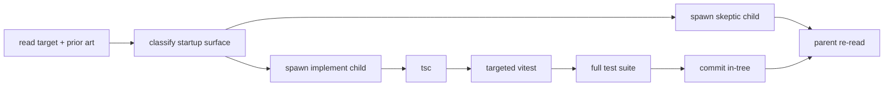

# config-gating-hotspot

use this when extending or auditing the startup-time config-gating pattern in `user/pi`.

## current state

the known migration set is done. use this skill for two cases only:

- a new extension adopts schema-backed startup gating
- an audit needs to re-check the disabled-behavior contracts

`packages/extensions/e2e/config-gating.test.ts` is now the session-level contract test for the final shape.

## goal

ship one adopter per commit, or run a bounded final-state audit, without blowing up context or broadening scope.



## invariants

- preserve true history over squeaky history.
- commit each finished adopter in-tree. do not squash or rebase.
- if you use `Task`, explicitly tell the child to commit in-tree before returning.
- smallest viable slice: one extension per commit.
- preserve runtime behavior when enabled/default config is used.
- invalid config falls back to defaults unless shared config semantics change.
- `enabled` is reserved by `getEnabledExtensionConfig(...)`. do not include it in the extension schema.
- do not broaden into live reload, watcher-based re-evaluation, or generic config-registry redesign.

## before editing

1. reread steering memories:
   ```bash
   rg "true history|commit in-tree|squeaky history|child agents to commit|preserve true history" ~/commonplace/01_files/_utilities/agent-memories
   ```
2. read the target extension file fully.
3. read the target package.json.
4. read `packages/core/config/index.ts` and confirm:
   - `getExtensionConfig(...)`
   - `getExtensionConfigWithSchema(...)`
   - `getEnabledExtensionConfig(...)` returning `{ enabled, config }`
5. read the nearest prior-art adopter that matches the slice shape.

## classify the slice

### simple adopter

tool-only startup surface that does not shadow a pi built-in.

examples:

- `packages/extensions/read-web-page/index.ts`
- `packages/extensions/oracle/index.ts`
- `packages/extensions/code-review/index.ts`
- `packages/extensions/format-file/index.ts`

expected disabled behavior:

- register no tools
- session-level contract: the tool name disappears from `session.getAllTools()` and `session.getActiveToolNames()`

### builtin shadow

tool-only startup surface that overrides a pi built-in tool name.

examples:

- `packages/extensions/bash/index.ts`
- `packages/extensions/read/index.ts`
- `packages/extensions/grep/index.ts`
- `packages/extensions/glob/index.ts` -> shadows builtin `find`

expected disabled behavior:

- skip only the `@bds_pi/*` wrapper registration
- pi's native tool with the same public name remains available
- session-level contract: assert fallback on tool metadata (`description`, parameter shape), not just tool presence

### startup-surface adopter

owns optional capabilities beyond a tool.

examples:

- `packages/extensions/search-sessions/index.ts` — tool + mention source
- `packages/extensions/handoff/index.ts` — tool + mention source + hooks + command
- `packages/extensions/system-prompt/index.ts` — hook-only

expected disabled behavior:

- register none of the startup capabilities owned by that extension
- if it owns a mention source, verify graceful degradation through `packages/core/mentions/resolve.ts`

## spawn pattern

use two `Task` children in parallel.

### child 1 — implement

give it:

- exact file paths
- required schema rules
- exact registration sites that must be gated
- exact verification commands
- explicit instruction to commit in-tree before returning

### child 2 — skeptic

give it:

- no-edit instruction
- ask it to verify assumptions with exact `file:line` evidence
- ask whether the schema is minimal and runtime-backed
- ask whether disabled behavior should suppress only the extension-owned startup surface

## implementation checklist

1. swap `getExtensionConfig` to `getEnabledExtensionConfig`.
2. add the smallest schema that matches actual runtime use.
   - require non-empty strings only when runtime truly needs non-empty strings.
   - allow empty strings when they already mean “use fallback” or “do nothing”.
   - enforce numeric bounds from actual runtime semantics, not vibes.
3. if the file lacks a seam, add `create...Extension(...)` with injectable deps.
4. load config first:
   ```ts
   const { enabled, config: cfg } = deps.getEnabledExtensionConfig(...)
   if (!enabled) return;
   ```
5. gate every startup registration owned by the extension.
6. keep enabled/default behavior unchanged.
7. extend inline vitest coverage in the same file.

## test expectations

for every adopter, cover all three:

1. enabled/default path still registers the expected startup capabilities.
2. disabled path registers the expected disabled surface for that adopter class.
3. invalid config falls back to defaults and still registers them.

for final-state audits, prefer the existing session-level split in `packages/extensions/e2e/config-gating.test.ts`:

- simple adopters: assert tool removal from both registered and active tool sets
- builtin shadows: assert fallback to pi built-ins by checking tool metadata, because the public tool name intentionally stays the same

mock shape for the helper:

```ts
vi.fn(<T extends Record<string, unknown>>(_namespace: string, defaults: T) => ({
  enabled: true,
  config: defaults,
}));
```

## verification gate

run these before committing:

```bash
bun x tsc -p tsconfig.build.json --noEmit
bun x vitest run "packages/extensions/<target>/index.ts"
bun run test
```

if the full suite prints known stderr from existing malformed-json coverage, note it, but do not treat it as a failure unless the suite fails.

## commit pattern

stage only your files.

for new adopters:

```text
feat(pi/<scope>): add schema-based startup gating
```

for audit/docs follow-up:

```text
docs(pi/skills): refresh config-gating hotspot
```

examples:

- `feat(pi/search-sessions): add schema-based startup gating`
- `feat(pi/handoff): add schema-based startup gating`
- `feat(pi/read-web-page): add schema-based startup gating`
- `docs(pi/skills): refresh config-gating hotspot`

## parent review before reporting

after the child returns:

1. re-read the changed file.
2. check `git status --short`.
3. check `git log --oneline -3`.
4. confirm the commit exists on the current branch.
5. report only traced facts.

## report template

- commit hash
- changed files
- verification results
- risks / blockers

when reporting findings, use:

- **confidence:** VERIFIED | HUNCH | QUESTION
- **location:** `file:line`
- **evidence:** what the code or command output shows
- **falsification:** what would disprove it, and whether you checked

## prior art

use these as templates before inventing anything:

- `packages/extensions/session-name/index.ts`
- `packages/extensions/search-sessions/index.ts`
- `packages/extensions/handoff/index.ts`
- `packages/extensions/system-prompt/index.ts`
- `packages/extensions/read-web-page/index.ts`

prefer copying a proven pattern over freestyling a new one.
